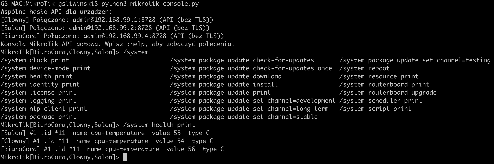

# Wspólna konsola API MikroTik

**Aktualna wersja: 1.3.5** (wartość z pliku `VERSION`).

Program łączy się równolegle z wieloma routerami przez natywne RouterOS API. Utrzymuje osobne połączenie API do każdego routera, wykonuje polecenia równolegle i pokazuje odpowiedzi jako rekordy oznaczone nazwą urządzenia.

Każdy MikroTik musi mieć skonfigurowany i osiągalny adres IP. RouterOS API działa przez TCP/IP, dlatego urządzeń bez adresu IP nie można obsłużyć tą aplikacją.

## Przykładowy ekran



## Konfiguracja routerów

Domyślna konfiguracja programu korzysta z nieszyfrowanego API na porcie TCP 8728. Na każdym routerze włącz usługę `api` i ogranicz dostęp do adresu komputera z aplikacją, na przykład:

```routeros
/ip service set api disabled=no address=192.168.88.10/32
```

Ogranicz dostęp także regułami firewalla. Użyj konta RouterOS z uprawnieniem `api` i tylko tymi pozostałymi uprawnieniami, których wymagają wykonywane polecenia. **Nieszyfrowane API przesyła hasło i polecenia jawnym tekstem**, więc używaj go wyłącznie w zaufanej sieci lokalnej lub przez VPN. RouterOS domyślnie używa portów 8728 dla API i 8729 dla API-SSL ([dokumentacja MikroTik](https://help.mikrotik.com/docs/spaces/ROS/pages/47579160/API)).

## Hasła

W `devices.json` wspólne ustawienia znajdują się w sekcji `defaults`; wpisy w `devices` zawierają zwykle tylko nazwę i adres routera. Ustawienia konkretnego urządzenia można nadpisać w jego wpisie. Tryb hasła ustaw w `defaults`:

- `"password_mode": "shared"` pyta raz o wspólne hasło dla routerów bez własnego ustawienia.
- `"password_mode": "individual"` pyta osobno dla każdego takiego routera.
- Wpis `"password_mode": "individual"` wewnątrz konkretnego urządzenia wymusza osobne hasło dla niego, nawet gdy trybem domyślnym jest `shared`.

Hasła są pobierane przy uruchomieniu i nie są zapisywane do pliku. Zobacz [devices.example.json](devices.example.json).

## Automatyczne wykrywanie urządzeń

`mikrotik-config-builder.py` skanuje podsieć przez port API, loguje się do odpowiadających routerów i pobiera ich nazwy z `/system identity`. Do wykrycia urządzenia potrzebne jest dostępne API oraz poprawny wspólny login i hasło. Hasło jest pytane w terminalu i nie trafia do pliku.

```sh
python3 mikrotik-config-builder.py --network 10.0.138.0/24
```

Program domyślnie używa nieszyfrowanego API na porcie 8728 i zapisuje wynik do `devices.json`. Jeśli plik już istnieje, zapyta przed zastąpieniem. Można wskazać inną podsieć, port, użytkownika i plik wynikowy, np. `--network 10.0.137.0/24 --output nowa-siec.json`. Dla API-SSL użyj `--ssl --port 8729`; certyfikat jest weryfikowany domyślnie. `--insecure` wyłącza tę weryfikację i należy go używać tylko świadomie.

Nazwa urządzenia pochodzi z RouterOS Identity. Gdy kilka urządzeń ma taką samą nazwę, generator dodaje do nazwy końcówkę z ostatnim oktetem adresu IP.

## Uruchomienie

```sh
cp devices.example.json devices.json
```

`devices.example.json` zawiera przykładowe 28 urządzeń `S01R1`–`S14R2` z adresami `10.0.138.1`–`10.0.138.28` i wspólnymi ustawieniami w `defaults`. Przed użyciem dostosuj nazwy i adresy do swojej sieci, po czym uruchom:

```sh
python3 mikrotik-console.py
```

## Parametry programów

### `mikrotik-console.py`

```sh
python3 mikrotik-console.py [--config PLIK_JSON]
```

| Parametr | Domyślna wartość | Opis |
|---|---|---|
| `-h`, `--help` | — | Wyświetla pomoc i kończy działanie. |
| `-c PLIK_JSON`, `--config PLIK_JSON` | `devices.json` | Wskazuje plik konfiguracji urządzeń. |
| `--password-prompt` | wyłączony | Ukryty, zgodnościowy przełącznik; hasła i tak są pobierane interaktywnie według `password_mode` w konfiguracji. |

#### Pola pliku `devices.json`

Konfiguracja zawiera sekcję `defaults` ze wspólnymi ustawieniami oraz tablicę `devices` z urządzeniami. Pola urządzenia mogą nadpisać odpowiadające im wartości domyślne.

| Pole | Domyślna wartość | Opis |
|---|---|---|
| `defaults` | `{}` | Wspólne ustawienia urządzeń; każde pole można nadpisać w konkretnym wpisie. |
| `devices` | wymagane | Niepusta tablica urządzeń. |
| `name` | wymagane | Nazwa urządzenia używana w konsoli; musi być unikalna. |
| `host` | wymagane | Osiągalny adres IPv4 lub IPv6 routera. |
| `username` | `admin` | Nazwa użytkownika API. |
| `port` | `8728` bez TLS, `8729` z TLS | Port TCP API; jawnie podana wartość zastępuje port wynikający z `ssl`. |
| `ssl` | `false` | `true` włącza API-SSL, `false` używa nieszyfrowanego API. |
| `verify_ssl` | `true` | Weryfikuje certyfikat API-SSL. Ma znaczenie, gdy `ssl` jest włączone. |
| `password_mode` | `shared` | `shared` pyta raz o wspólne hasło, a `individual` pyta osobno dla każdego urządzenia. Wpis urządzenia może nadpisać tryb z `defaults`. |

Starsze pliki mogą ustawiać `password_mode` na najwyższym poziomie JSON; nowe konfiguracje powinny umieszczać go w `defaults`.

### `mikrotik-config-builder.py`

```sh
python3 mikrotik-config-builder.py [PARAMETRY]
```

| Parametr | Domyślna wartość | Opis |
|---|---|---|
| `-h`, `--help` | — | Wyświetla pomoc i kończy działanie. |
| `--network CIDR` | `10.0.138.0/24` | Podsieć IPv4, którą skaner sprawdza pod kątem dostępności API. |
| `--username NAZWA` | `admin` | Wspólna nazwa użytkownika API używana do logowania i zapisana w sekcji `defaults`. Hasło jest pytane w terminalu. |
| `--port PORT` | `8728` | Port TCP API skanowanych routerów. Przy `--ssl` podaj port API-SSL, zwykle `8729`. |
| `--ssl` | wyłączony | Używa API-SSL zamiast nieszyfrowanego API. |
| `--insecure` | wyłączony | Wyłącza weryfikację certyfikatu; działa tylko z `--ssl`. |
| `--timeout SEKUNDY` | `1.5` | Maksymalny czas próby połączenia z jednym adresem. |
| `--workers LICZBA` | `48` | Maksymalna liczba równoległych prób połączenia. |
| `--max-hosts LICZBA` | `4096` | Limit liczby adresów do sprawdzenia w podanej podsieci. |
| `--output PLIK` | `devices.json` | Ścieżka pliku JSON, do którego zostanie zapisana konfiguracja. |
| `--force` | wyłączony | Zastępuje istniejący plik wynikowy bez pytania. Bez tego przełącznika program pyta o zgodę w terminalu. |

Przykład skanowania innej podsieci z API-SSL i zapisem do osobnego pliku:

```sh
python3 mikrotik-config-builder.py --network 192.168.88.0/24 --ssl --port 8729 --output routers.json
```

## Obsługa konsoli

- Wpisz polecenie RouterOS, aby wysłać je równolegle do wybranych urządzeń, np. `/system identity print`.
- Ścieżki można wpisać ze spacjami albo ukośnikami, np. `/system package update check-for-updates` lub `/system/package/update/check-for-updates`.
- Tab podpowiada też aktualizację RouterOS: `/system package print`, sprawdzenie aktualizacji, pobranie, wybór kanału oraz instalację. `download` pokazuje zbiorczy postęp zamiast wypisywać każdy fragment pobierania. `install` pobiera i instaluje aktualizację, po czym router uruchamia się ponownie. Przed instalacją wybierz router przez `:only nazwa`, aby nie zrestartować wszystkich wybranych urządzeń naraz.
- `:list` pokazuje urządzenia i ich stan.
- `:only router-dom,router-biuro` wybiera urządzenia docelowe.
- `:all` wybiera wszystkie połączone urządzenia.
- `:reconnect` zamyka stare sesje i próbuje połączyć ponownie ze wszystkimi routerami z konfiguracji; niedostępne urządzenia można ponowić kolejnym `:reconnect`.
- `/system reboot`, `/system routerboard upgrade` oraz `/system/reset-configuration` są podpowiadane przez Tab. Reset konfiguracji kasuje ustawienia routera i może zerwać połączenie; przed poleceniem wybierz pojedyncze urządzenie przez `:only nazwa`.
- `Tab` podpowiada typowe ścieżki z głównych gałęzi IP, SYSTEM i TOOLS oraz komendy konsoli.
- Tab podpowiada również `/system routerboard upgrade` do aktualizacji RouterBOOT, `/system reboot` do restartu oraz `/system/reset-configuration` do resetu konfiguracji. Po restarcie użyj `:reconnect`, aby ponownie połączyć się bez zamykania aplikacji.
- Podpowiedzi `/tool romon print` i `/tool romon set enabled=yes` pokazują stan i włączają RoMON na wybranym urządzeniu.
- `:help` pokazuje pomoc, a `:quit` zamyka połączenia.

Konsola przekazuje komendy do API bez zamkniętej listy RouterOS akcji, więc może obsługiwać komendy dostępne w danej wersji RouterOS i jej pakietach, o ile są dostępne przez API. Polecenia można podać jako ścieżkę CLI ze spacjami albo API ze znakami `/`; po `print` można użyć API query, np. `/ip/address/print ?address=192.168.99.1/24`. Typowe warunki CLI po `where` są tłumaczone na zapytania API. Każdy rekord mieści atrybuty w jednym wierszu, zawijanym do szerokości terminala. API nie jest terminalem tekstowym: nie przekazuje ANSI-owego paska postępu ani interaktywnych pytań. Podpowiadanie Tab korzysta z listy przykładowych poleceń w programie; nie pobiera dynamicznych podpowiedzi z routera.

Tylko końcowe statusy polecenia `/system package update check-for-updates` są kolorowane w terminalu: „System is already up to date” na zielono, inne końcowe statusy na czerwono. Status pośredni „finding out latest version...” oraz odpowiedzi pozostałych komend pozostają w domyślnym kolorze terminala. Kolory są wyłączone przy przekierowaniu wyjścia oraz po ustawieniu `NO_COLOR`.
